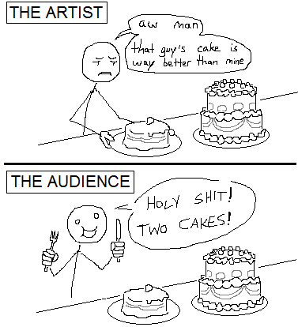

# 为什么写博客？

_2020年 5月 2日 · #blogging_

在学习 Rust 时我一直被几个概念所困扰，所以我尝试通过写 Markdown 组织我的想法。
我很快便有了好几个 Markdown 文件。我想， _也许可以开始写博客？_ 但我意识到，
_不行，我的小博客永远不会像 Niko Matsakis、Saoirse Shipwreckt、
Huon Wilson、David Tolnay、Alexis Beingessner、Daniel Keep、Carl Fredrik Samson、
Aleksey Kladov、Amos Wegner、Pascal Hertleif、Dimitri Sabadie、
Daniel Henry-Mantilla、
Steve Klabnik、Jake Goulding 和 Carol Nichols 的那样出彩。_
这个名单一点也不全面，还缺好几十个人呢！
有好多比我聪明得多的人已经在写这一类东西了。但是，我有一个独特的优势：我很蠢。
聪明人更倾向于写抽象文章给聪明人看。对于像我这样的傻瓜来说，
市面上有一个巨大的空白，我打算把它填上。

另外，这张图不错：

_作者：[stuffman](https://stuffman.tumblr.com/)_

## 行，但为什么要放到 GitHub 仓库里而不是建一个网站？

我是一个全栈网页网络开发人员，所以我对网站 _非常挑剔_ 。
我致力于做一个 _完美的前端_ ，但是一点东西也没写出来。
我知道有[无数静态网页生成器](https://www.staticgen.com/)把九成以上的工作都做完了，
但我都试了一遍却一个也不喜欢。不是因为它们不好，实际上很多都不错，
但我是个工匠，更喜欢自己动手。这是个问题，我知道。

我差点放弃了我的这个想法，但后来我看见了 [Frank McSherry 的博客](https://github.com/frankmcsherry/blog)。
哇！我怎么这么蠢，愣是没想到可以这样？不需要折腾一点前端！只要把文章放到 GitHub 上，
别人就可以直接读了，无比简单。我喜欢这样。我决定也这么做，这样我就有时间写东西了。

另：这个博客只有关于 Rust 的事，除了这篇文章没有任何个人的事。

## 参阅

- [Common Rust Lifetime Misconceptions](./../../common-rust-lifetime-misconceptions.md)
- [Rust 标准库特性指南](./tour-of-rusts-standard-library-traits.md)
- [Sizedness in Rust](./../../sizedness-in-rust.md)
- [RESTful API in Sync & Async Rust](./../../restful-api-in-sync-and-async-rust.md)
- [2020 年的 Rust 学习指南](./learning-rust-in-2020.md)
- [Learn Assembly with Entirely Too Many Brainfuck Compilers](./../../too-many-brainfuck-compilers.md)
